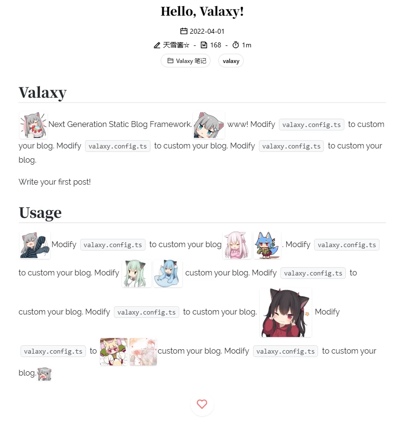

# valaxy-addon-face

Valaxy 表情包插件，让你在文章中更方便地使用表情包（行内图片表情）。需要自己在本地准备好表情图片资源。



## Usage

```bash
pnpm i valaxy-addon-face
```

### 加载插件

```ts
//valaxy.config.ts
import { defineValaxyConfig } from 'valaxy'
import { addonFace } from 'valaxy-addon-face'

export default defineValaxyConfig({
  addons: [
    addonFace({
      // 配置
      defaultSuffix: 'webp'
    }),
    // 如果不配置：
    //'valaxy-addon-face'
  ],
})
```

配置项：

- defaultSize：全局默认表情图片高度，css 长度，默认`3.5em`，也可以在使用时传参`size`单独定义每个表情
- defaultSuffix：全局默认后缀名，默认`png`，也可以在使用时传参单独定义每个表情
- path：表情包和表情名之前的路径，默认`/img/face/`，你可以设为其他网站的

### 准备表情包

需要自己在本地准备好表情图片资源。

```
public
├── img
│   ├── face
│   │   ├── mys（表情包）
│   │   │   ├── 0.png（表情）
│   │   │   ├── 1.png
│   │   │   ├── ...
│   │   ├── n（表情包）
│   │   │   ├── ...
```

- 这里有一些表情包，https://github.com/2X-ercha/Twikoo-Magic
- 使用机器人`Stickerdownloadbot`或`stickerset2packbot`下载 Telegram 中的贴纸包，如
    - 彩色猫羽 https://t.me/addstickers/AmashiroNatsukiEars_NoWord
    - 小脸猫羽 https://t.me/addstickers/AmashiroNatsukiEars_Twitch
    - nacho https://t.me/addstickers/nachonekodayo
    - https://t.me/addstickers/AmashiroNatsukiNya
- 设法搞到 QQ 里的表情
- 在小云群里找咱要

### 在 Markdown 中使用

使用`face`属性指定表情，格式`表情包名:表情名[后缀名]`。也可不写后缀名，此时根据`suffix`（传参的或全局的）来确定后缀名，默认`png`。

```vue
<!--  your-post.md  -->
<!--表情（public/img/face/mys/27.png）-->
<AFace face="mys:27"/>

<!--表情（public/img/face/mys/27.gif）-->
<!--       表情         尺寸           后缀名-->
<AFace face="mys:27" size='1.8em' suffix='gif'/>

<!--表情（public/img/face/mys/27.webp）-->
<!--       表情带后缀名      -->
<AFace face="mys:27.webp"/>
```

